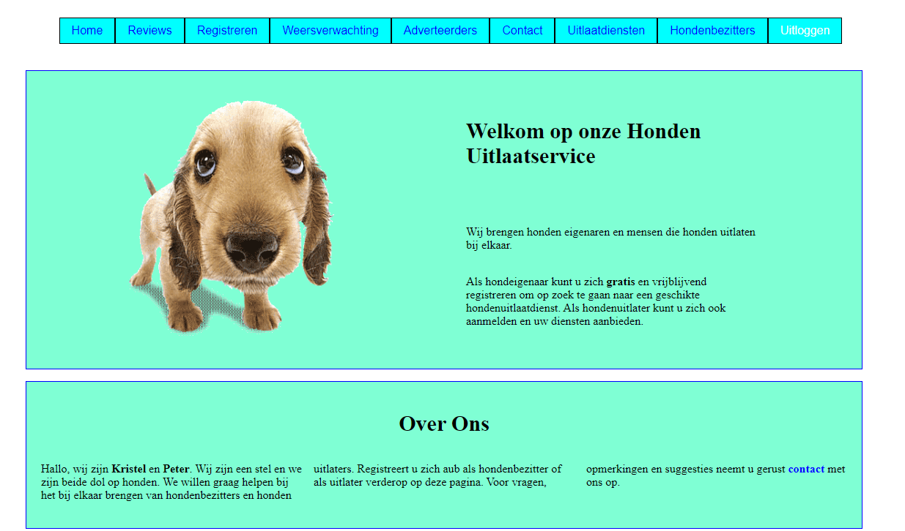

# Opdrachtbeschrijving

## Inleiding

Je gaat een bloggingplatform bouwen waarbij sommige url's niet toegankelijk zijn voor gebruikers die niet zijn ingelogd.
Je gaat ook concepten als doorlinken, dynamische parameters en een nep-login toepassen. De "login"-funtionaliteit is
voor deze opdracht met opzet versimpelt.



## Applicatie starten

Als je het project gecloned hebt naar jouw locale machine, installeer je eerst de `node_modules` door het volgende
commando in de terminal te runnen:

```
npm install
```

Wanneer dit klaar is, kun je de applicatie starten met behulp van:

```
npm run start
```

of gebruik de WebStorm knop (npm start). Open [http://localhost:3000](http://localhost:3000/) om de pagina in de browser
te bekijken. 

## Webpaginas

De website heeft x paginas:

1. Home pagina (`/`)
2. Login pagina (`/login`)
3. Blog Overzicht pagina (`/blogposts`)
4. Blogpost pagina (`/blog/:blogId`)

Er zijn 2 JSON data files :

1. dogowners.json
2. dogservices.json


Zoals je hebt gezien is er in de `App.js` een stukje state aanwezig die registreert of iemand ingelogd is of niet. Deze
informatie ga je gebruiken om elementen conditioneel weer te geven, maar ook om jouw routes te beveiligen.

* Zorg ervoor dat wanneer een gebruiker op de "Inlog"-knop op de Login pagina klikt, de `isAuthenticated` state
  van `true` naar `false` getoggled wordt. 

* Je zult de waarde en setter-functie (callback prop) dus vanaf `App.js` moeten
  doorgeven aan de pagina of component die deze waardes nodig heeft.

- Als een bezoeker *wel* ingelogd is, moet er een "uitloggen"-knop in de navigatie staan. Als je daarop klikt wordt de
  gebruiker direct uitgelogd en naar de home-pagina gestuurd.

- Maak voor de beveiligde routes een apart `<PrivateRoute>` component voor die je kunt hergebruiken!
- Voeg een React hook form toe aan de login pagina waar de gebruiker ook daadwerkelijk gegevens kan invullen. Je kunt
  dan een `users.json` bestand maken met gebruikers erin, zodat je iemand daadwerkelijk kunt laten "inloggen" met een
  bestaand account.

